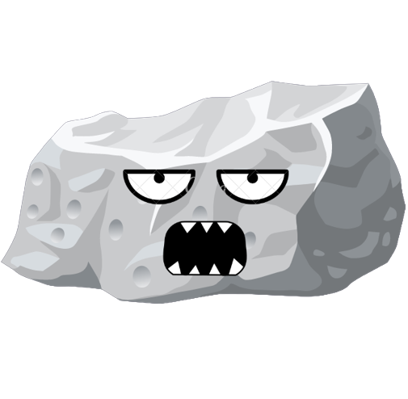
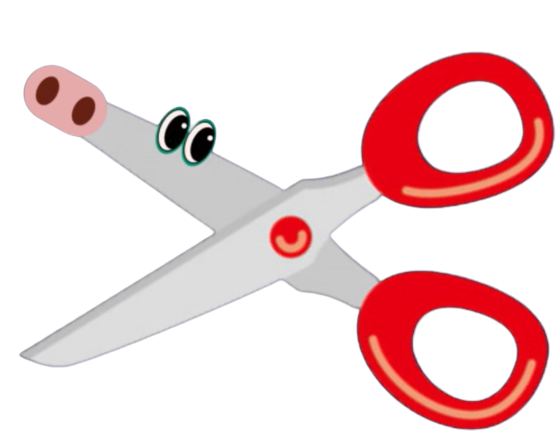

# Rock Paper Scissors


Rock Paper Scissors is an interesting and simple hand game played by many people around the world for generations. It is often used as a fair choosing method between two players in order to settle a dispute or make an unbiased group decision. This site is designed to play this well-known game on your device.

Users of this application will be able to experience this game with some images and animations. So it is targeted towards people who want to play a fair game with some nice animations. In this game you are playing against a fully automated computer that chooses one of the options randomly.


## Table of Contents
----

+ [Design](#design "Design")
    + [Flow Diagram](#flow-diagram "Flow Diagram")
    + [Wireframes](#wireframes "Wireframes")
    + [Colour Scheme](#colour-scheme "Colour Scheme")
    + [Typography](#typography "Typography")
+ [Features](#features "Features")
    + [Existing Features](#existing-features "Existing Features")
        + [The Header](#the-header "The Header")
        + [The Section](#the-section "The Section")
            + [Weapons Area](#weapons-area "Weapons Area")
            + [Fighting Area](#fighting-area "Fighting Area")
            + [Draw Message Area](#draw-message-area "Draw Message Area")
        + [The Footer](#the-footer "The Footer")
    + [Features Left to Implement](#features-left-to-implement "Features Left to Implement")
+ [Testing](#testing "Testing")
    + [Manual Testing](#manual-testing "Manual Testing")
        + [Buttons Testing](#buttons-testing "Buttons Testing")
        + [Draw Message Testing](#draw-message-testing "Draw Message Testing")
        + [Winning Animation Testing](#winning-animation-testing "Winning Animation Testing")
        + [Losing Animation Testing](#losing-animation-testing "Losing Animation Testing")
    + [Validator Testing](#validator-testing "Validator Testing")
    + [Unfixed Bugs](#unfixed-bugs "Unfixed Bugs")
+ [Deployment](#deployment "Deployment")
+ [Credits](#credits "Credits")
    + [Content](#content "Content")
    + [Media](#media "Media")

## Design
----

### Flow Diagram

To structure and aid in creating the website, a basic flow diagram was created which is linked below.

[Flow Diagram](documentation/Rock-Paper-Scissors-diagram.pdf)

### Wireframes

Please see below, a link to wireframes for the site layout.

[Wireframes](documentation/Rock-Paper-Scissors-wireframes.pdf)

### Colour Scheme

+ One main colour was used in this website which suit the background. The colour is:

    

+ And two secondary colours were used for the scores result. The colours are:

     

### Typography

To make this application seem like a playful application, these two fonts were chosen:
+ The font [Tilt Warp](https://fonts.google.com/?query=Tilt+Warp) was applied to all of the elements.
+ The font [Climate Crisis](https://fonts.google.com/?query=Climate+Crisis) was applied only to the main heading.

## Features
----

### Existing Features

+ #### The Header
    + Featured at the top of the page, the header shows the main headining of the website.
    + The main heading used the [Climate Crisis](https://fonts.google.com/?query=Climate+Crisis) unique font to make it look special.


+ #### The Section
    + ##### Weapons Area
        + The weapons area is to allow the user to click on any weapon they want.
        + There are a total of three weapons to choose from.

        <br>

        

    + ##### Fighting Area
        + Fighting Area is to compare the player's weapon with the computer's weapon.
        + These two images correspond to the player's choice and the computer's choice.
        + Three potential results out of the fight: Win, Lose or Draw.

        <br>

        

    + ##### Draw Message Area
        + The Draw Message only appears when the computer chose the same weapon as the player's.
        + The Draw Message also shows which weapon the computer has chosen.

        <br>

        

+ #### The Footer
    +  The Footer is to show the socre of both the player and the computer


### Features Left to Implement

+ Add an online feature so that a player can play vs another player instead of a computer.
+ Add difficulty options when playing against computer.

## Testing
----
+ I tested that the page work in different browsers: Firefox, Brave, Chrome, Microsoft Edge, Safari.
+ I confirm that the project is responsive, looks good and functions on all standard screen sizes using both the devtools device toolbar and [Am I Responsive?](https://ui.dev/amiresponsive?url=https://georgehazaka.github.io/Rock-Paper-Scissors/) website.
+ I confirm that all buttons (weapons) work properly.

### Manual Testing

+ #### Buttons Testing

    | Feature             | Expect                                            | Action                      | Result                                |
    | ------------------- | ------------------------------------------------- | --------------------------- | ------------------------------------- |
    | **Rock button**     | When clicked the player's weapon becomes a rock   | Clicked the rock button     | The player's weapon became a rock     |
    | **Paper button**    | When clicked the player's weapon becomes a paper  | Clicked the paper button    | The player's weapon became a paper    |
    | **Scissors button** | When clicked the player's weapon becomes scissors | Clicked the scissors button | The player's weapon became a scissors |

+ #### Draw Message Testing

    | Feature             | Expect when draw | Action | Result when draw |
    | ------------------- | ------------------- | ------ | ------------------- |
    | **Rock button**     | When clicked a draw message will appear saying "It's A Draw, Computer chose: Rock" | Clicked the rock button | The draw message appeared saying "It's A Draw, Computer chose: Rock" |
    | **Paper button**     | When clicked a draw message will appear saying "It's A Draw, Computer chose: Paper" | Clicked the paper button | The draw message appeared saying "It's A Draw, Computer chose: Paper" |
    | **Scissors button**     | When clicked a draw message will appear saying "It's A Draw, Computer chose: Scissors" | Clicked the scissors button | The draw message appeared saying "It's A Draw, Computer chose: Scissors" |

+ #### Winning Animation Testing

    | Feature             | Expect when winning | Action | Result when winning |
    | ------------------- | ------------------- | ------ | ------------------- |
    | **Rock button**     | When clicked the player's weapon becomes an angry version of a rock and it rushes to attack the computer's weapon | Clicked the rock button | The player's weapon became an angry version of a rock and it attacked the computer's weapon |
    | **Paper button**    | When clicked the player's weapon becomes an angry version of a paper and it rushes to attack the computer's weapon | Clicked the paper button | The player's weapon became an angry version of a paper and it attacked the computer's weapon |
    | **Scissors button** | When clicked the player's weapon becomes an angry version of scissors and it rushes to attack the computer's weapon | Clicked the scissors button | The player's weapon became an angry version of scissors and it attacked the computer's weapon |

+ #### Losing Animation Testing

    | Feature             | Expect when losing | Action | Result when losing |
    | ------------------- | ------------------ | ------ | ------------------ |
    | **Rock button**     | When clicked the player's weapon becomes a dizzy version of a rock and the computer rushes to attack the player's weapon | Clicked the rock button | The player's weapon became a dizzy version of a rock and the computer attacked the player's weapon |
    | **Paper button**    | When clicked the player's weapon becomes a sad version of a paper and the computer rushes to attack the player's weapon | Clicked the paper button | The player's weapon became a sad version of a paper and the computer attacked the player's weapon |
    | **Scissors button** | When clicked the player's weapon becomes a broken sad version of scissors and the computer rushes to attack the player's weapon | Clicked the scissors button | The player's weapon became a broken sad version of scissors and the computer attacked the player's weapon |

### Validator Testing

+ HTML
    + No errors were found when passing through the official [W3C validator](https://validator.w3.org/nu/?doc=https%3A%2F%2Fgeorgehazaka.github.io%2FRock-Paper-Scissors%2F)

    <br>

    
+ CSS
    + No errors were returned when passing through the official [(Jigsaw) validator](https://jigsaw.w3.org/css-validator)

    <br>

    

+ JAVASCRIPT
    + No errors were returned when passing through the official [Jshint validator](https://jshint.com/)
    + The following Metrics were returned:
        + There are 13 functions in this file.
        + Function with the largest signature take 2 arguments, while the median is 0.
        + Largest function has 42 statements in it, while the median is 1.
        + The most complex function has a cyclomatic complexity value of 10 while the median is 1.
    + 37 warnings were returned:
        + 23 x 'const' is available in ES6 (use 'esversion: 6') or Mozilla JS extensions (use moz). Lines(1 - 8, 12, 14 - 21, 23, 24, 34 - 37).
        +  7 x 'let' is available in ES6 (use 'esversion: 6') or Mozilla JS extensions (use moz). Lines (10, 39, 46, 98, 110, 131, 143).
        +  3 x 'template literal syntax' is only available in ES6 (use 'esversion: 6'). Lines (46, 98, 110).
        +  2 x 'template literal syntax' is only available in ES6 (use 'esversion: 6'). Lines (40, 64).
        +  1 x 'arrow function syntax (=>)' is only available in ES6 (use 'esversion: 6'). Line (106).
        +  1 x 	Functions declared within loops referencing an outer scoped variable may lead to confusing semantics. (getComputerWeapon, computerRandomWeapon, drawAnimation, playerChild, computerChild, incrementPlayerScore, incrementComputerScore). Line (47).

+ Accessibility
    + I confirmed that the colors and fonts chosen are accessible and easy to read by running it through lighthouse in devtools.


### Unfixed Bugs

No unfixed bugs.

## Deployment
----
+ The site was deployed to GitHub pages. The steps to deploy are as follows:
    1. In the GitHub repository, navigate to the Settings tab
    2. From the Code and automation section, click on Pages
    3. From the Pages section drop-down menu, select the "main" option inside the Branch section
    4. Afterwards the page will be automatically refreshed with a detailed ribbon display to indicate the successful deployment.

The live link can be found here - [Rock, Paper, Scissors](https://georgehazaka.github.io/Rock-Paper-Scissors/)

## Credits
----

### Content

+ The idea of the Rock, Paper, Scissors website was taken from Project Portfolio > [Portfolio 2](https://learn.codeinstitute.net/courses/course-v1:CodeInstitute+JSE_PAGPPF+2021_Q2/courseware/30137de05cd847d1a6b6d2c7338c4655/c3bd296fe9d643af86e76e830e1470dd/) > Portfolio Project Scope video.
+ The code of the incrementPlayerScore() and the incrementComputerScore() functions are taken from Love Maths Walkthrough Project > [Displaying The Question and Getting The Answer](https://learn.codeinstitute.net/courses/course-v1:CodeInstitute+LM101+2021_T1/courseware/2d651bf3f23e48aeb9b9218871912b2e/8775beaed6ed403d92318845af971b30/?child=first) > Updating The Scores video.
``` 
    let oldScore = parseInt(document.getElementById("computer-score-span").textContent);
    document.getElementById("computer-score-span").textContent = ++oldScore;
```

### Media

+ The favicon was created in [favicon.io](https://favicon.io/)
+ | Images created in [Canva](https://www.canva.com/)                       | Images taken from open source sites                                |
  | ----------------------------------------------------------------------- | ------------------------------------------------------------------ |
  |                                          |  |
  |                                |        |
  |                               |                                                                    |
  |                                        |                                                                    |
  |                              |                                                                    |
  |                               |                                                                    |
  |                                  |                                                                    |
  |    |                                                                    |
  |      |                                                                    |
  |  |                                                                    |
  |    |                                                                    |


